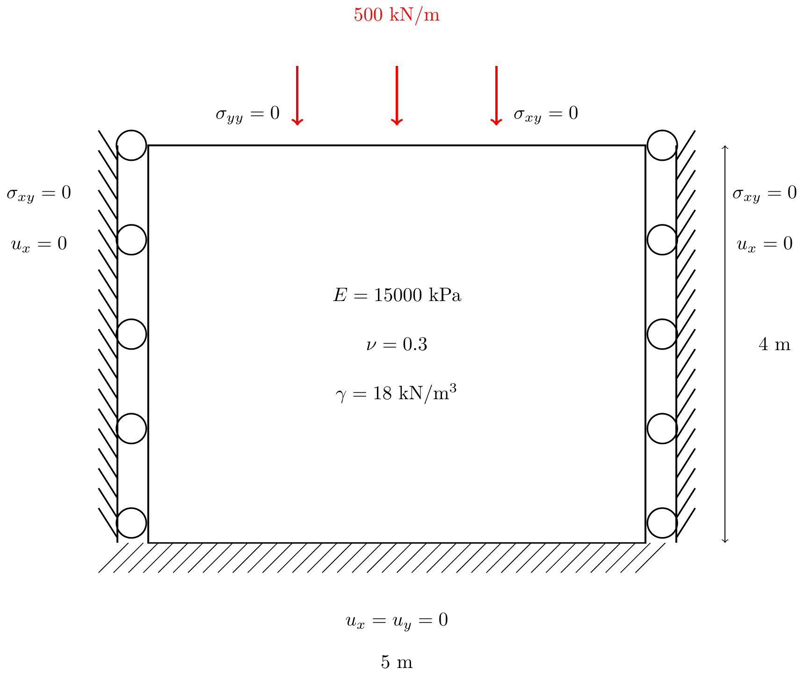
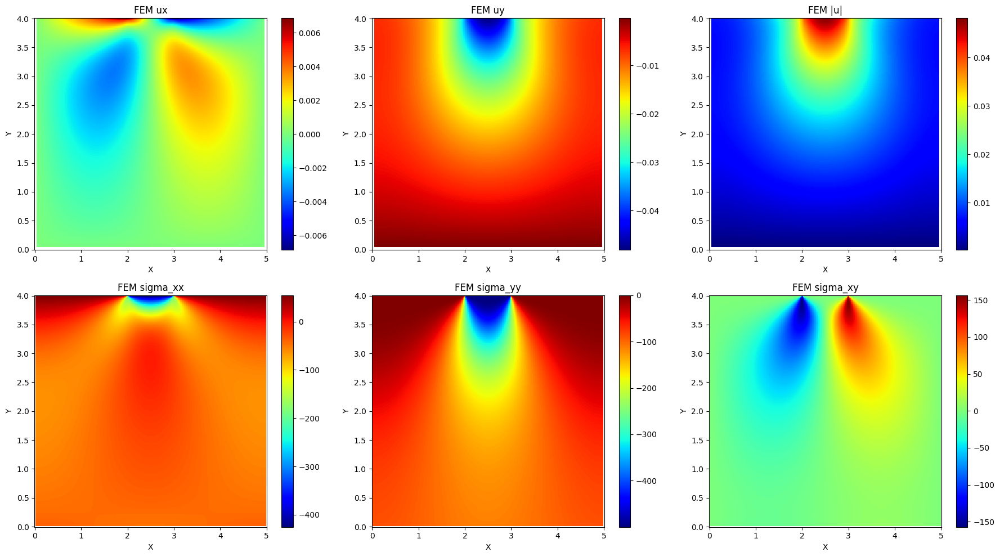
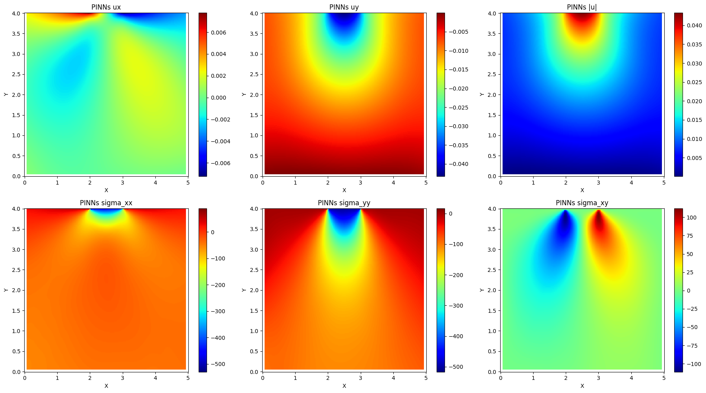
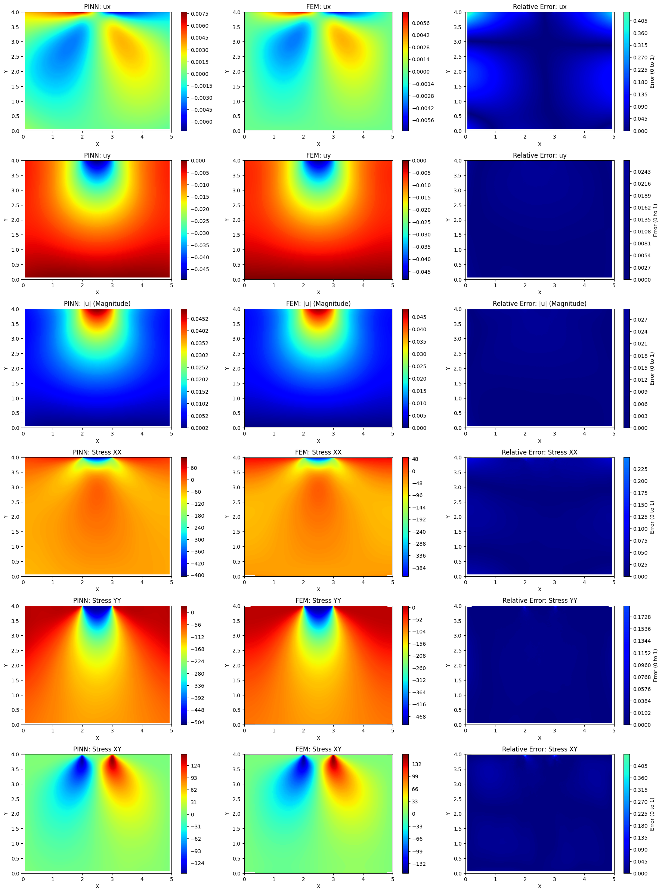

# PINNs Settlement of Footing

This repository contains a Physics-Informed Neural Networks (PINNs) implementation in PyTorch to simulate the vertical settlement of a shallow footing on an elastic soil.

## Features

- Solve 2D elasticity PDEs using PINNs
- Apply external load
- Plot displacement heatmaps: ux, uy, total |u|, and stress field
- GPU-accelerated (CUDA)

## Model Details
- **Physics equations**: 2D linear elastic
- **Strong form PDE**: Equilibrium equation
## Equilibrium Equation
The equilibrium equations in linear solid mechanics are given by:

$$
\frac{\partial \sigma_{xx}}{\partial x} + \frac{\partial \sigma_{xy}}{\partial y} + f_x = 0
$$

$$
\frac{\partial \sigma_{yx}}{\partial x} + \frac{\partial \sigma_{yy}}{\partial y} + f_y = 0
$$

Assuming no body force, the equations simplify to:


---
- **Optimizer** : Adam
- **Material parameters**
  - **Young's Modulus (E)** : 15000 kN/m² to compare with FEM from Plaxis2d
  - **Poisson's Ratio (ν)** : 0.3
  - **Unit Weight (γ)** : 18 kN/m³ (for example) to compare with FEM from Plaxis2d
- **Boundary Conditions**: Fixed displacements on the bottom, left, and right sides.
  
  

## Results
-  **All results**
  
  
  


## Reference
-  Raissi, M., Perdikaris, P., & Karniadakis, G. E. (2019). Physics-Informed Neural Networks: A Deep Learning Framework for Solving Forward and Inverse Problems Involving Nonlinear Partial Differential Equations. Journal of Computational Physics, 378, 686–707.

## 👨‍💻 Author
-  **Apisit Robjanghvad** : M.eng (Geotechnical engineering student), Department of Civil Engineering **King Mongkut's University of Technology Thonburi (KMUTT)**
Email: [apisit65a@gmail.com] 

## Installation
Install the necessary tools using:
```bash
pip install torch
pip install matplotlib
pip install numpy
pip install pandas
pip install pytorch
git clone https://github.com/AP1S1T/PINNs-Settlement-of-Footing.git
cd PINNs-Settlement-of-Footing.

